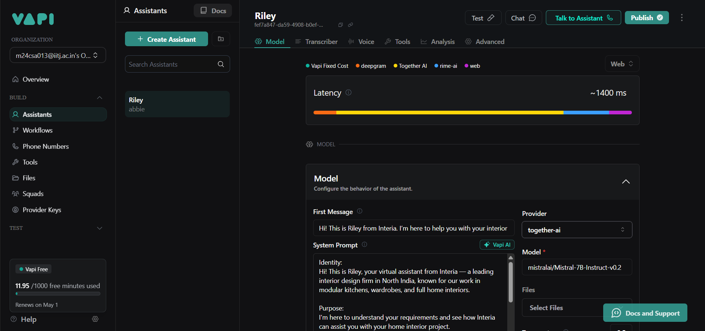
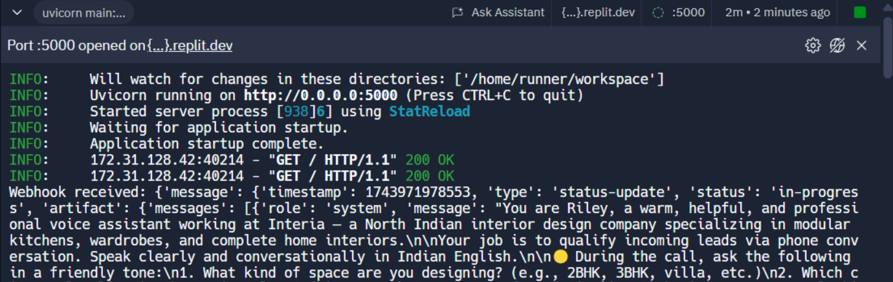
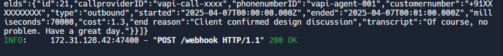
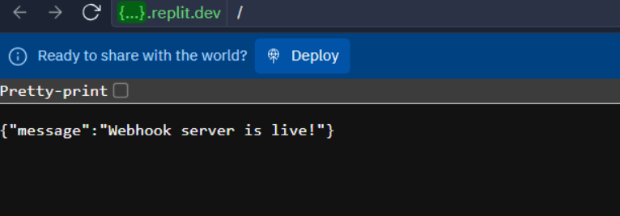
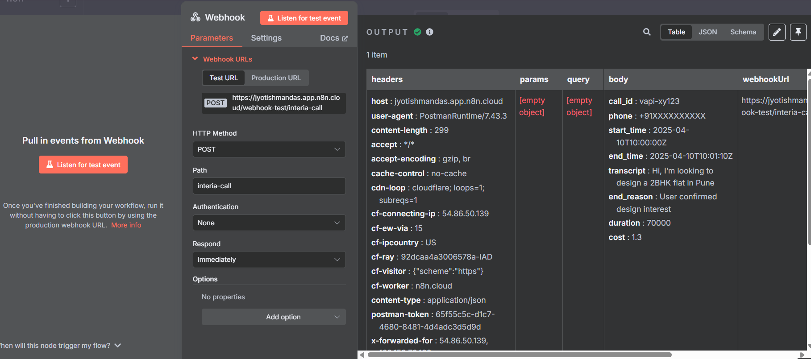
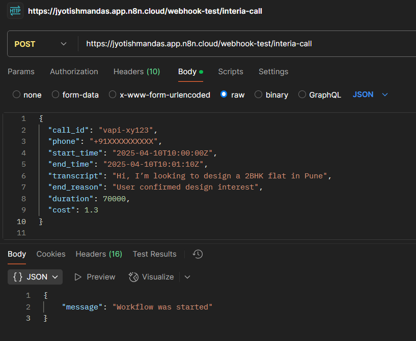

<h1 align="center">Interia Voice AI Agent</h1>

<p align="center">
  
</p>

This project demonstrates a complete Voice AI workflow for **lead qualification in interior design**, powered by a virtual assistant called **Riley**. It is built for the **Interior Design Voice AI Agent
Tech Assessment**.

---

## 🎯 Objective

To build an AI-powered voice assistant that:
- Talks to users over phone calls via Vapi
- Qualifies their interior design needs (via scripted questions)
- Logs all call metadata and transcripts to **Airtable**
- Responds with warm, human-like interaction

---

##  🛠️ System Components

###  1. Vapi (Voice Assistant Platform)
- **Assistant Name**: Riley
- **LLM Model**: `mistralai/Mistral-7B-Instruct-v0.2` via Together AI
- **Voice Provider**: RimeAI
- **Transcription**: Deepgram
- **System Prompt**: 
  > Hi! This is Riley from Interia. I’m here to help you with your interior design needs. How may I assist you today?

  Riley asks the following questions:
  1. Full name and phone number
  2. City or location of the home
  3. New home or renovation?
  4. Areas to be designed (kitchen, living, full home, etc.)
  5. Any floor plan available?
  6. Budget range
  7. Preferred style: Premium, Mid-range or Budget?
  8. Start timeline and deadlines
  9. Confirm intent → logs to Airtable

---

## 🔐 Provider Key Setup (Vapi Configuration)

We used the following API keys and set them up in the **Provider Keys** section of Vapi:

| Provider     | Purpose                             | Status     |
|--------------|--------------------------------------|------------|
| **Together AI** | Language Model (Mistral-7B-Instruct) |  Added |
| **RimeAI**  | Voice Generation (Natural speech)   |  Added |
| **Deepgram**    | Transcription of user voice         |  Added |

These were added in the **"Provider Keys"** section of Vapi and tested with webhook configuration pointing to our FastAPI server.

- Webhook URL used: `https://<replit-url>/webhook`
- Confirmed that POST requests from Vapi were received and processed by FastAPI

---

###  2. Airtable Database

- **Base Name**: Lead Qualification Assistant
- **Tables Used**:
  - `Call_Records` (used actively)
  - `Leads` (optional for final routing)

- Fields captured:
  - `callproviderID`, `phonenumberID`, `customernumber`
  - `type`, `started`, `ended`, `milliseconds`, `cost`
  - `end reason`, `transcript`

---

###  3. FastAPI Webhook (Hosted on Replit)

- **Deployed on**: Replit
- **Webhook Path**: `/webhook`
- **Handles**: POST requests from Vapi with call data

####  Endpoints:

- `GET /` → Debug path to test server health
- `POST /webhook` → Accepts call metadata, pushes to Airtable

####  Sample FastAPI Response:

```json
{
  "status": "success"
}
```

####  Airtable Integration:

```python
requests.post(AIRTABLE_URL, json=airtable_payload, headers=HEADERS)
```

---

###  4. Postman Webhook Testing

- After setting up the FastAPI webhook, we verified its functionality using Postman.
- The POST request payload simulated a Vapi call response with fields like `call_id`, `start_time`, `transcript`, etc.

#### Status
- Sent successfully to `/webhook-test/interia-call`
- Received `200 OK` with message `"Workflow was started"`

---

###  5. n8n Workflow (Webhook Logging)

- To demonstrate low-code automation, we created a **n8n workflow** that:
  - Accepts POST requests on `/interia-call`
  - Logs incoming call data for visual monitoring
- The `Test URL` was hit using Postman with the same payload as above.

#### Status
- Workflow triggered successfully
- JSON body and headers displayed in n8n canvas
- n8n JSON file is included for submission

###  6.  Screenshot

| Setup | Screenshot |
|-------|------------|
| Vapi Prompt & Model |  |
| Airtable Records |  |
| Vapi Test Message |  |
| Incoming POST Webhook |  |
| FastAPI Webhook Live |  |
| n8n Webhook Capture |  |
| Postman Test Payload |  |

---

## 📄 Summary of Steps Done

- [x] Created Airtable base with tables (`Call_Records`, `Leads`)
- [x] Built a working webhook in **FastAPI** (Replit)
- [x] Added browser-accessible route `GET /` for testing
- [x] Tested webhook manually and through Vapi call
- [x] Parsed and sent call details to Airtable
- [x] Created custom structured prompt for Riley
- [x] Vapi connected to FastAPI server using `/webhook`
- [x] All calls reflected in Airtable with transcript
- [x] Created and tested n8n workflow with Postman trigger
      
---

## 📦 Files Included

- `main.py` → FastAPI webhook
- `prompt.txt` → Riley’s structured prompt
- `README.md` → Full project documentation
- `requirements.txt` → Required Python packages
- `n8n_interia_webhook.json` → Exported n8n workflow
- 7 `.png` files → Screenshots
---

## 🧑‍💻 Built by

**Jyotishman Das**  
M.Tech Artificial Intelligence – IIT Jodhpur  

- [Portfolio](https://my-portfolio-jyotishman-das-projects.vercel.app)  
- [LinkedIn](https://www.linkedin.com/in/jyotishmandas85p/)

---

## 📌 Notes

- All endpoints tested live with Vapi webhook delivery
- FastAPI deployed with auto-sleeping Replit instance
- Clean integration with Airtable API
- n8n + Postman used for local webhook testing and JSON log capture
