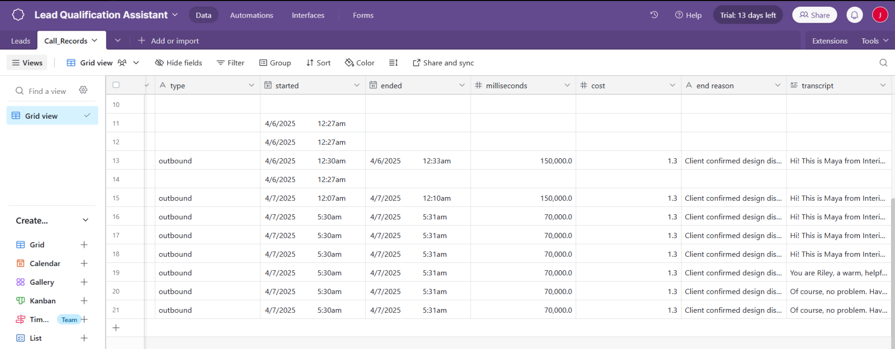

# 🛠️ Interia Voice AI Agent 

This project demonstrates a complete Voice AI workflow for **lead qualification in interior design**, powered by a virtual assistant called **Riley**. It is built for the **Interior Design Voice AI Agent
Tech Assessment**.

---

## 🎯 Objective

To build an AI-powered voice assistant that:
- Talks to users over phone calls via Vapi
- Qualifies their interior design needs (via scripted questions)
- Logs all call metadata and transcripts to **Airtable**
- Responds with warm, human-like interaction

---

##  System Components

### 🔹 1. Vapi (Voice Assistant Platform)
- **Assistant Name**: Riley
- **LLM Model**: `mistralai/Mistral-7B-Instruct-v0.2` via Together AI
- **Voice Provider**: ElevenLabs
- **Transcription**: Deepgram
- **System Prompt**: 
  > Hi! This is Riley, your virtual assistant from Interia — a leading interior design firm in North India, known for our work in modular kitchens, wardrobes, and full home interiors.

  Riley asks the following questions:
  1. Full name and phone number
  2. City or location of the home
  3. New home or renovation?
  4. Areas to be designed (kitchen, living, full home, etc.)
  5. Any floor plan available?
  6. Budget range
  7. Preferred style: Premium, Mid-range or Budget?
  8. Start timeline and deadlines
  9. Confirm intent → logs to Airtable

---

### 🔹 2. Airtable Database

- **Base Name**: Lead Qualification Assistant
- **Tables Used**:
  - `Call_Records` (used actively)
  - `Leads` (optional for final routing)

- Fields captured:
  - `callproviderID`, `phonenumberID`, `customernumber`
  - `type`, `started`, `ended`, `milliseconds`, `cost`
  - `end reason`, `transcript`

---

### 🔹 3. FastAPI Webhook (Hosted on Replit)

- **Deployed on**: Replit
- **Webhook Path**: `/webhook`
- **Handles**: POST requests from Vapi with call data

####  Endpoints:

- `GET /` → Debug path to test server health
- `POST /webhook` → Accepts call metadata, pushes to Airtable

####  Sample FastAPI Response:

```json
{
  "status": "success"
}
```

####  Airtable Integration:

```python
requests.post(AIRTABLE_URL, json=airtable_payload, headers=HEADERS)
```

---

### 🔹 4.  Screenshot

| Setup | Screenshot |
|-------|------------|
| Vapi Prompt & Model |  |
| Airtable Records |  |
| FastAPI Webhook Live |  |
| Incoming POST Webhook |  |
| Vapi Test Message |  |

---

##  Summary of Steps Done

- [x] Created Airtable base with tables (`Call_Records`, `Leads`)
- [x] Built a working webhook in **FastAPI** (Replit)
- [x] Added browser-accessible route `GET /` for testing
- [x] Tested webhook manually and through Vapi call
- [x] Parsed and sent call details to Airtable
- [x] Created custom structured prompt for Riley
- [x] Vapi connected to FastAPI server using `/webhook`
- [x] All calls reflected in Airtable with transcript

---

## 💡 Optional (Not Implemented)

- [ ] n8n Workflow for parallel Airtable push (skipped as FastAPI is used)
- [ ] Dual logging to both `Call_Records` and `Leads`

---

## 📦 Files Included

- `main.py` → FastAPI webhook
- `prompt.txt` → Riley’s structured prompt
- `README.md` → Full project documentation
- `requirements.txt` → Required Python packages

---

## 🧑‍💻 Built by

**Jyotishman Das**  
M.Tech Artificial Intelligence – IIT Jodhpur  

- [Portfolio](https://my-portfolio-jyotishman-das-projects.vercel.app)  
- [LinkedIn](https://www.linkedin.com/in/jyotishmandas85p/)

---

## 📌 Notes

- All endpoints tested live with Vapi webhook delivery
- FastAPI deployed with auto-sleeping Replit instance
- Clean integration with Airtable API
